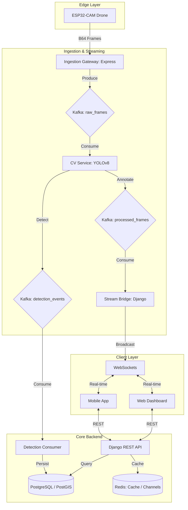

# SkyMarshal API

A high-performance, distributed Django REST backend for intelligent aerial surveillance. SkyMarshal leverages real-time computer vision, message queuing, and geographic data analysis to provide autonomous drone fleet management, vehicle detection, and automated traffic violation enforcement.

## 🏗️ System Architecture

SkyMarshal uses a decoupled, event-driven architecture designed for low-latency video processing and high scalability.



## 🚀 Features

### 📡 Advanced Streaming Modes
- **Live Stream**: Direct ingestion from ESP32-CAM modules via high-speed ingestion gateways.
- **Simulated Mode**: Deterministic testing environment using pre-loaded video feeds for CV pipeline calibration.
- **Real-Time Handshake**: Dynamic drone-to-server discovery and configuration sync.

### 🧠 Intelligent Computer Vision
- **Centralized YOLOv8 Pipeline**: Single source of truth for vehicle detection (Cars, Trucks, Motorcycles, Buses).
- **ALPR Integration**: Automated license plate recognition using EasyOCR.
- **Telemetry-Synced Annotations**: PostGIS-powered geospatial data mapped directly to video frames.
- **Speed Estimation**: Perspective-transformed calculations for accurate traffic monitoring.

### 🛡️ Traffic Enforcement & Compliance
- **Automated Citations**: Rule-based violation creation (Speeding, Illegal Maneuvers).
- **Evidence Management**: Snapshot and video clip generation for each detection event.
- **Incentive System**: "Safe Driving" points and lottery system to promote road safety compliance.
- **Unified Vehicle Registry**: Real-time status lookup (Active, Stolen, Suspended).

### 🛠️ Distributed Infrastructure
- **Message Queuing**: Kafka for heavy frame processing; RabbitMQ for background tasks and notifications.
- **Real-Time Updates**: Django Channels for instant dashboard alerts and live stream delivery.
- **Multi-Channel Alerts**: Automated notifications via AWS SES (Email) and AWS SNS (SMS).

## 🛠️ Tech Stack

| Component | Technology | Role |
| :--- | :--- | :--- |
| **Framework** | Django 5.0 / DRF 3.14 | Core Logic & API |
| **Database** | PostgreSQL 15 + PostGIS | Geospatial Storage |
| **Cache / WS** | Redis 7 | State Management & WebSockets |
| **Stream Bus** | Confluent Kafka 7.5 | Frame & Event Bus |
| **Inference Engine** | YOLOv8 (Ultralytics) | Real-time Object Detection |
| **OCR** | EasyOCR | License Plate Recognition |
| **Task Queue** | RabbitMQ / Celery | Async Jobs & Scheduled Tasks |
| **Gateway** | Express.js | High-concurrency Ingestion |
| **ASGI Server** | Daphne | WebSocket Handling |
| **Monitoring** | Flower / Sentry | Celery Monitoring & Error Reporting |

## 🔄 Ingestion Workflow

SkyMarshal follows a strict 6-phase lifecycle for every patrol session:

1.  **Initiation**: Officer starts patrol via API; system initializes drone pairing.
2.  **Handshake**: ESP32 fetches configuration and endpoint settings via polling.
3.  **Ingestion**: Device pushes B64-encoded frames to the Express Gateway.
4.  **Inference**: CV Service consumes raw frames, runs YOLO/ALPR, and produces annotated frames.
5.  **Delivery**: Stream Bridge broadcasts processed frames to clients via WebSockets.
6.  **Persistence**: Detection Consumer saves metrics and violation data to PostGIS.

## 🏁 Getting Started

### Prerequisites
- Python 3.10+
- Docker & Docker Compose
- AWS Credentials (optional, for notifications)

### Quick Setup (Docker)
The easiest way to run the full stack (12+ services) is using Docker Compose:

```bash
docker-compose up -d
```

### Manual Setup
1.  **Clone & Env**: 
    ```bash
    cp .env.example .env
    ```
2.  **Initialize**:
    ```bash
    ./setup.sh
    ```
3.  **Run Services**:
    ```bash
    # Terminal 1: Django API
    python manage.py runserver
    
    # Terminal 2: Celery Worker
    celery -A api worker --loglevel=info
    
    # Terminal 3: CV Pipeline
    python computer_vision/main.py
    ```

## 📂 Project Structure

- `apps/`: Modular Django applications (Core, Drones, Patrols, Detections, etc.)
- `computer_vision/`: YOLOv8 detection and annotation engine.
- `scripts/`: Utility scripts (e.g., `generate_drone_key.py`).
- `api/`: Project settings, ASGI/WSGI, and Celery config.

## 📜 License & Contributing

Distributed under the MIT License. See [LICENSE](LICENSE) for details. Contributions are welcome—please review [CONTRIBUTING.md](CONTRIBUTING.md).

## 🔗 External Resources

- **[Sky Marshal Technical Reference](https://gist.github.com/TanyaMushonga/8791c3a9399597e9bde615d2e4fecbb8)**: Comprehensive architecture deep-dive and documentation for the full ecosystem.

---
*Maintained by [Tanya Mushonga](https://github.com/TanyaMushonga)*
